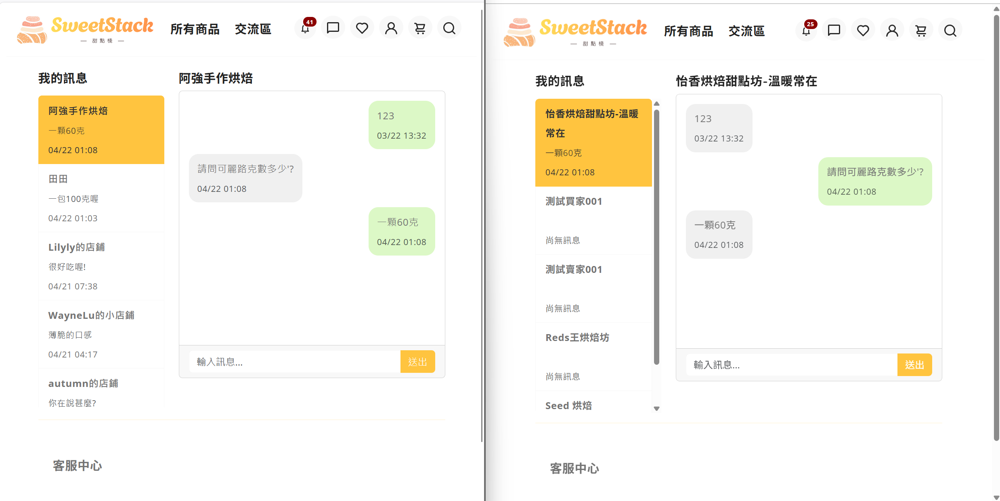
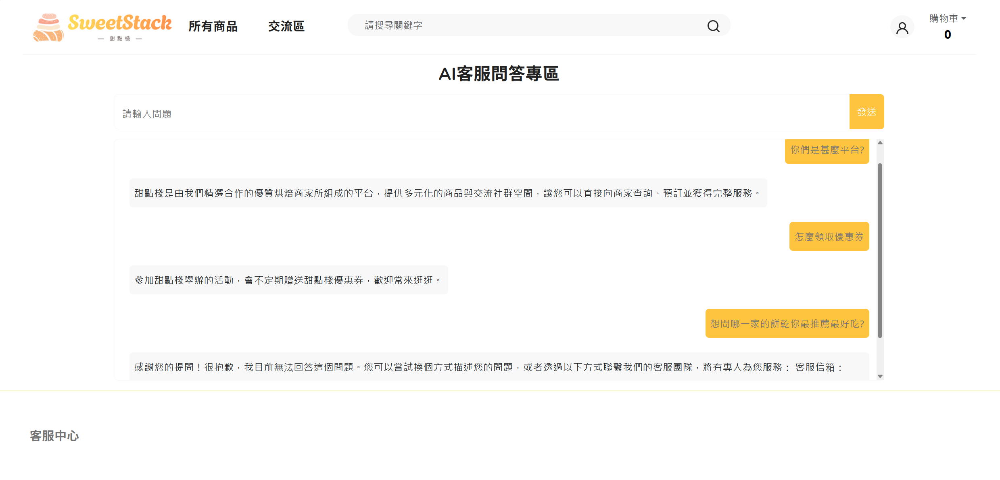
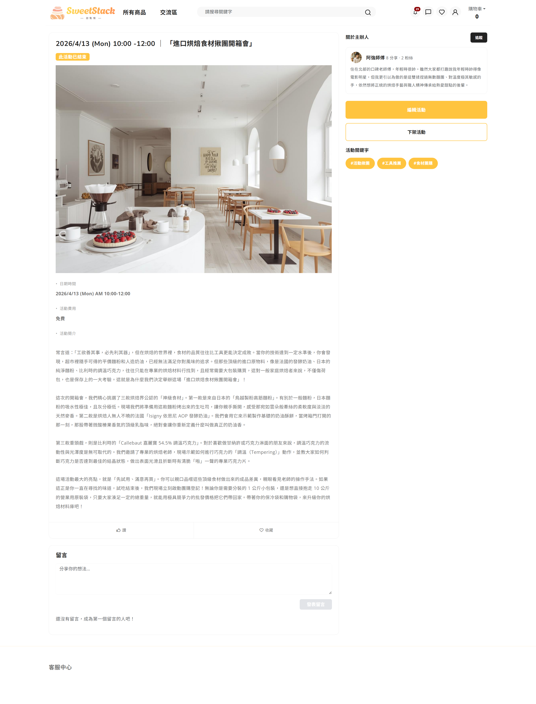

# 陳潔（Chieh Chen)｜.NET 全端工程師

近 10 年商業實戰背景的轉職工程師。2026 年完成緯育 TibaMe C# 全端培訓，專注於 ASP.NET Core MVC、Web API 與 SQL Server 的後端開發。

過去近 6 年於外商泰優 TaskUs 擔任金流客服分析師，連續獲得年度最佳員工肯定；更早近 4 年於采泥藝術擔任行銷企劃，主導品牌官網改版與大型展覽專案。跨領域累積的使用者視角、需求分析與跨部門協作能力，是我獨特的優勢。

---

## 🍰 甜點棧｜C2C 烘焙電商與交流平台

四人團隊、2個月從零打造的 ASP.NET Core MVC 全端電商平台，涵蓋商品、訂單、社群、即時聊天與 AI 客服共 17 個功能模組。

- 🔗 **團隊專案 GitHub**：https://github.com/WayneLu0407/Bake
- 🎬 **Demo 影片**：https://youtu.be/uH6yRcZ9O9Q?si=rEzEJypoM0hUSuGG&t=349
- 👩‍💻 **我的角色**：組長 + 主責後端與資料庫設計
- 📊 **量化貢獻**：144 commits 為團隊最高貢獻者（#1 / 4 人）

### 個人技術亮點

**1. AI 客服 API（Azure AI Foundry）**
- 設計 RESTful API 端點，接收前端 POST 請求並串接 Azure SDK
- 加入信心分數判斷邏輯（< 0.4 自動導向客服信箱），避免低準確度回答誤導使用者
- API 金鑰透過 IConfiguration 從 appsettings.json 讀取，避免敏感資訊外洩

**2. 即時聊天室（SignalR + EF Core）**
- 使用 SignalR Hub 實作 WebSocket 雙向通訊，搭配 Group 機制處理多房間訊息隔離
- 設計 ChatController（HTTP）+ ChatHub（WebSocket）分層架構，分別處理頁面載入與即時訊息
- 實作聊天室成員權限檢查，防止使用者存取非授權的聊天記錄

**3. 商品模組完整 CRUD（EF Core + LINQ）**
- 使用 LINQ 巢狀查詢與多層投影（Select to ViewModel），組合商品篩選、排序、關鍵字搜尋
- 實作 Model Validation（Required、StringLength 等 Attribute）做後端資料驗證
- 後台賣家管理系統：新增 / 修改 / 刪除 / 查詢 + 賣場暫停經營

**4. 資料庫設計（MS SQL Server）**
- 個人主責會員模組資料表設計，主導使用 bcrypt 演算法處理密碼雜湊的資安決策
- 基於 6 年金流客服實務經驗，前瞻性設計平台金流相關資料表結構（含系統日誌、第三方支付紀錄、賣家錢包帳務、平台代管金流），作為平台未來金流模組擴充基礎

### 團隊領導實踐

- 主持每日站會、運用 Scrum / Kanban 工作法，帶領團隊從進度落後追上並在後期功能豐富度超越其他組
- 主動邀請資深工程師進行 Code Review，協調講師課後補充技術觀念
- 執行 Monkey Test，彙整問題清單並追蹤修正進度
- 繪製 Wireframe、Sitemap、ER Model 等前置規劃文件

---
## 📸 專案截圖

### 首頁

### 即時聊天室

### AI 客服

### 活動細節 

---

## 🛠 技術棧

**後端**  
C# / ASP.NET Core MVC / Web API / Entity Framework / LINQ / SignalR

**前端**  
HTML / CSS / JavaScript / jQuery / Vue（搭配 MVC）/ Bootstrap

**資料庫**  
MS SQL Server（資料表設計、主鍵 / 外鍵關聯、JOIN 查詢）

**雲端服務**  
Azure App Service / Azure SQL / Azure AI Foundry

**開發工具**  
Visual Studio / Visual Studio Code / Git / Figma

**敏捷開發**  
Scrum / Kanban

---

## 🌐 語言能力

- 英文：TOEIC 735（聽說讀寫精通，外商工作環境使用）
- 韓文：TOPIK 3 級
- 中文：母語

---

## 📫 聯絡方式

- ✉️ Email：jessiev180@gmail.com
- 💼 LinkedIn：https://www.linkedin.com/in/%E6%BD%94-%E9%99%B3-345a031a2/
- 🐙 GitHub：https://github.com/jessiev180
